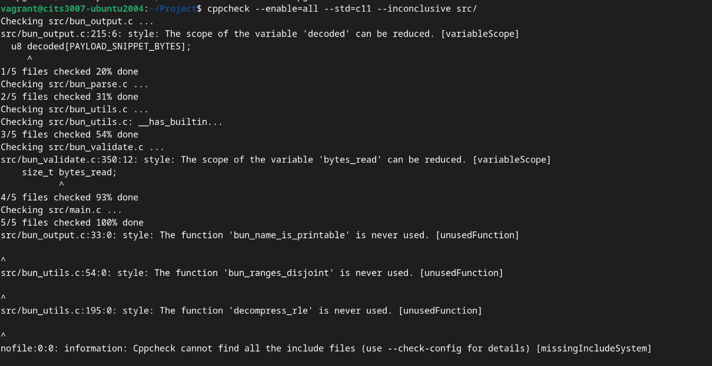

<!--
REPORT ASSEMBLY NOTES (member 4)

Section ownership (per our collaboration plan):
  1. Output format and exit codes          - Member 1
  2. Decisions, assumptions, integer safety - Member 2
  3. Libraries used                         - Member 2
  4. Tools used (with concrete evidence)    - Member 3 (+ Member 4 to cross-check)
  5. Security aspects / MMORPG deployment   - Member 3
  6. Coding standards                       - Member 4
  7. Challenges                             - Member 4 (collected from everyone)

Build to PDF (requires pandoc + a TeX toolchain):
    pandoc report/report.md -o report/report.pdf --pdf-engine=xelatex

Submission checklist:
  [ ] group number, names, student numbers, github usernames all filled
  [ ] all TODO markers in this document resolved
  [ ] every "Tools used" entry has a concrete issue+commit link
  [ ] report/report.pdf committed (but NOT the .md if anything embarrassing)
-->

## 1. Output format and exit codes

> **_Section owner: Member 1_**

### 1.1 Valid files

When the parser successfully validates a file it writes a human-readable
summary to standard output. The summary has two blocks: the header, followed
by one block per asset record.

```
TODO (member 1): paste a real run of
    ./bun_parser tests/fixtures/valid/02-single-uncompressed.bun
here and describe the format briefly. The brief says each field in the header
and each asset record must be represented, and that names/payloads may be
truncated to ~60 bytes.

Note for the format: we're rendering payloads as escaped text if the first
64 bytes look printable, else as a classic hex dump. Helpers are in
bun_output.{c,h}.
```

### 1.2 Invalid files

For malformed / unsupported files, one violation per line is written to
standard error, in the form:

```
bun_parser: <file>: <byte-offset>: <message>
```

followed by as much of the (still-parseable) content on stdout as can be
safely displayed.

```
TODO (member 1): paste a real run against
    tests/fixtures/invalid/06-overlapping-sections.bun
and
    tests/fixtures/invalid/10-nonprintable-name.bun
to demonstrate the violation-list format.
```

### 1.3 Exit codes

| Code | Name              | Meaning                                                |
|------|-------------------|--------------------------------------------------------|
| 0    | `BUN_OK`          | File parsed and validated successfully                 |
| 1    | `BUN_MALFORMED`   | Spec violation found                                   |
| 2    | `BUN_UNSUPPORTED` | Valid file, but uses zlib, checksum, or unknown flags  |
| 3    | `BUN_ERR_IO`      | I/O error while reading (including "file not found")   |
| 4    | `BUN_ERR_ARGS`    | Wrong number of CLI arguments (TODO member 1: confirm) |
| 5-10 | -                 | Reserved for future use                                |

The spec reserves 0-2 for parse outcomes and permits 3-10 for other errors;
we have allocated 3 and 4 and kept 5-10 free.

## 2. Decisions, assumptions, and integer safety

> **_Section owner: Member 2 (integer-safety subsection: Member 3)_**

### 2.1 Design decisions

```
TODO (member 2):

- Why we read fields individually rather than casting the on-disk bytes to
  a struct pointer. (Struct padding, alignment, endianness.)

- How we handle section order. The spec allows any order after the header;
  we sort the three non-header sections by offset before validating
  overlap. See bun_parse.c::<function>.

- How we handle "gaps" between sections. The spec says the content is
  unspecified for non-canonical files; we do not validate gap content.

- How RLE decompression is implemented: streaming expansion into a bounded
  output buffer so we don't allocate `uncompressed_size` bytes at once.
```

### 2.2 Assumptions

```
TODO (member 2): the one that will come up in the oral interview is how we
interpret "asset names must be printable ASCII" (spec section 5 - we treat
exactly the range 0x20..0x7E, no space-only names? yes or no? justify).

Other likely judgement calls:
- What happens if asset_count * 48 overflows when added to
  asset_table_offset? We treat it as BUN_MALFORMED and report "asset table
  extends past EOF".
- When compression=0 but uncompressed_size != 0, we return BUN_MALFORMED
  per spec section 5.1 note 1.
- flags bits outside {ENCRYPTED, EXECUTABLE} -> BUN_UNSUPPORTED per spec
  section 5.1 note 7.
```

### 2.3 Integer safety

> _Subsection owner: Member 3_

All offset/size arithmetic on u32/u64 fields coming from disk uses
overflow-safe helpers (`bun_u64_add`, `bun_u64_mul` in `bun_output.c`),
which wrap `__builtin_add_overflow` / `__builtin_mul_overflow` with a
portable fallback.

```
TODO (member 3): expand on the specific call sites that matter:
  - asset_count * BUN_ASSET_RECORD_SIZE   (attacker-controlled u32)
  - data_section_offset + data_offset     (u64 + u64, can still overflow)
  - name_offset + name_length             (u32 + u32 - we widen to u64
                                           before adding per spec 9.5)
  - RLE count * expansion factor
Attach one concrete example of a malicious input that would exploit the
naive check and how our version catches it.
```

## 3. Libraries used

> **_Section owner: Member 2_**

| Library          | Purpose                              | Why it's acceptable              |
|------------------|--------------------------------------|----------------------------------|
| `libcheck`       | Unit testing (link-time for `make test`) | Test-only, not shipped          |
| _(runtime: none)_ | -                                   | Parser has no runtime deps      |

The deployed `bun_parser` has no third-party runtime dependencies - it
links only against libc.

## 4. Tools used

> **_Section owner: Member 3, with Member 4 verifying the evidence links_**

Every entry below points to an **actual finding** and a commit that fixed
it; reviewers can reproduce them by checking out the "before" commit and
running the reproduction command.

### 4.3 - cppcheck static analysis

- Command

```bash 
cppcheck --enable=all --std=c11 --inconclusive src
```
Issue - [#10](https://github.com/sepehrmoghani/CITS3007-project/issues/10)

- Findings
  - Variable scope warnings-
      These variables are declared earlier than needed in the files
    - bun_output.c — `decoded` scope can be reduced
    - bun_validate.c — `bytes_read` scope can be reduced

- Unused function warnings -
These functions are defined but never called internally.
    - bun_output.c— `bun_name_is_printable` is never used
    - bun_utils.c — `bun_ranges_disjoint` is never used  
    - bun_utils.c— `decompress_rle` is never used

Terminal Image- 


Fix Commits - [commit 405a6ab6893680fba8ec4ea6e5f90f3ea870dd9c](https://github.com/sepehrmoghani/CITS3007-project/pull/9/changes/405a6ab6893680fba8ec4ea6e5f90f3ea870dd9c) and [commit dd135a3205f12276b769915f4e74d43c005f39f7](https://github.com/sepehrmoghani/CITS3007-project/pull/9/changes/dd135a3205f12276b769915f4e74d43c005f39f7)


### 4.2 AddressSanitizer + UndefinedBehaviorSanitizer

- **How invoked:** `make asan && ./bun_parser tests/fixtures/<case>.bun`
- **Findings:**
  ```
  TODO (member 3): fill at least one entry like:

  - Issue #N: ASan heap-buffer-overflow in bun_parse_assets when asset_count
    was not cross-checked against file size. Reproduction:
    `git checkout <bad-commit>; make asan;
     ./bun_parser tests/fixtures/invalid/07-asset-count-oversized.bun`.
    Fixed in commit <sha>.
  ```

### 4.3 `gcc -fanalyzer`

- **How invoked:** `gcc -std=c11 -Wall -fanalyzer -c bun_parse.c`
- **Findings:**
  ```
  TODO (member 3): issue reference + before/after commit.
  ```

### 4.4 `clang-tidy` / `scan-build`

- **How invoked:** `sudo apt-get install clang-tools; scan-build make all`
- **Findings:**
  ```
  TODO (member 3 - optional if nothing lands; the sanitizers alone cover
  the evidence requirement, but scan-build usually finds at least a
  dead-store or similar).
  ```

### 4.5 Fuzzing (optional)

```
TODO (member 3): if we get time, run AFL++ on bun_parser against the
fixtures dir as a corpus. One real finding here materially helps the
"tools used" section.
```

## 5. Security aspects - "Brutal Orc Battles In Space" deployment

> **_Section owner: Member 3_**

```
TODO (member 3): the brief asks us to reason about shipping this parser
inside an MMO client that auto-downloads .bun files from Trinity's servers.
Key threats to address:

  1. Supply-chain / MITM: what happens if a .bun is tampered with in transit.
     (CRC-32 in the format is not a security primitive. Suggest adding a
     signature over the whole file, e.g. Ed25519.)

  2. Malicious server / compromised player-UGC: crafted .bun files trying
     to exploit the parser. Parser must treat every byte as adversarial.
     Memory safety via our sanitizer sweep and bounds/overflow checks.

  3. Amplification: RLE can expand 2 bytes -> 510 bytes. Payloads claiming
     huge uncompressed_size could exhaust memory. We enforce a cap.

  4. Encryption flag: spec leaves what "encrypted" means up to the client.
     Recommend specifying a MAC'd encryption scheme in the format to
     prevent oracle attacks.

  5. Executable flag: spec lets assets be marked executable. Downloading
     a .bun from another player and running an "executable" asset without
     sandboxing is game-over. Recommend dropping the EXECUTABLE flag from
     the spec or at least requiring signed assets for it.

Recommendations we would make:
  - Add a signature section (e.g. detached Ed25519 over everything).
  - Drop or restrict BUN_FLAG_EXECUTABLE.
  - Strengthen CRC-32 to a cryptographic hash when checksum != 0.
  - Specify a maximum uncompressed_size per asset.
  - Client should sandbox the parser (seccomp / unprivileged subprocess).
```

## 6. Coding standards

> **_Section owner: Member 4_**

We adopted the following conventions for the codebase; the full rationale
is recorded in `HACKING.md`.

- **Language:** C11, `-std=c11 -Wall -Wextra -Wpedantic -Wshadow -Wconversion
  -Wstrict-prototypes -Wformat=2`; sanitizer builds additionally enable
  `-fsanitize=address,undefined`.
- **Layout:** 2-space indent, K&R braces, 100-col lines, `UpperCamelCase`
  for types and `snake_case` for functions and variables. Public parser
  entry points are prefixed `bun_`.
- **Module boundaries:**
  - `bun.h` holds the public API and on-disk type definitions (sizes
    enforced by `BUN_HEADER_SIZE == 60` and `BUN_ASSET_RECORD_SIZE == 48`
    constants).
  - `bun_parse.c` owns parsing and validation; it does **not** call
    `printf` / `fprintf` - output is confined to `main.c`, which keeps
    unit tests clean.
  - `bun_output.c/.h` provides pure helpers (printability tests, hex
    dumps, overflow-safe `u64` arithmetic) that both the parser and the
    output path use.
- **Memory:** no heap allocation proportional to file size; fixed stack
  buffers sized to `BUN_HEADER_SIZE` and `BUN_ASSET_RECORD_SIZE`; all
  offset/size arithmetic goes through `bun_u64_add` / `bun_u64_mul`.
- **Untrusted input:** every byte read from the file is treated as
  adversarial. Names are rendered via `bun_print_escaped`, which caps
  output and escapes non-printable bytes.
- **Tests:** libcheck suite organised into `output-helpers`, `overflow-helpers`,
  `header`, `assets`, and `io` TCases; fixtures are machine-generated by
  `tests/make_fixtures.py` and their expected exit codes recorded in
  `tests/fixtures/expectations.tsv`.

## 7. Challenges

> **_Section owner: Member 4, collected from everyone_**

```
TODO (member 4): collect one or two bullet points from each member about
what they found hard and how they addressed it. Keep this honest; the
rubric explicitly asks about "impact if you were unable to address them".

Representative headings so we don't overlap:
  - (Member 1) Struct padding / alignment when reading from disk
  - (Member 2) Deciding the RLE expansion strategy
  - (Member 3) Getting ASan to catch the overflow case rather than just
               "memory error" without specifics
  - (Member 4) Writing tests that exercise spec-violation paths without
               the parser existing yet (TDD on the skeleton)
  - Logistical: coordinating on the shared `BunParseContext` fields.
```
